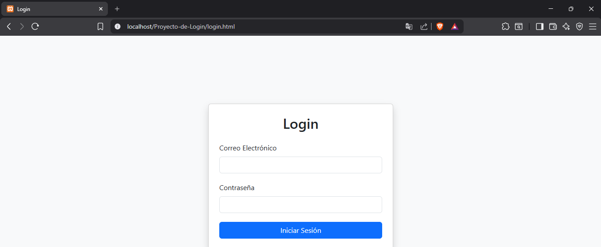
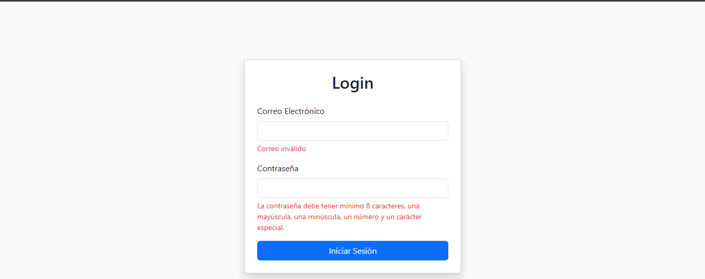
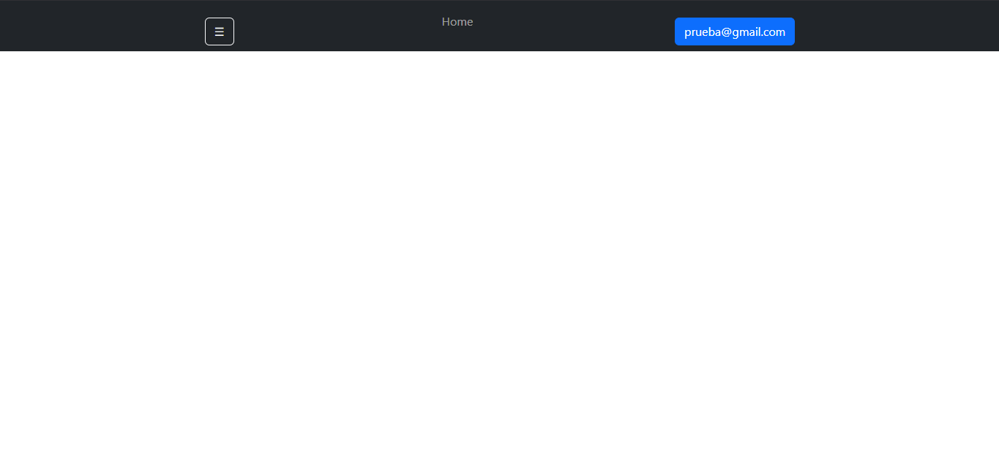
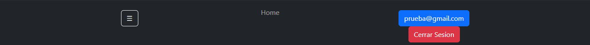
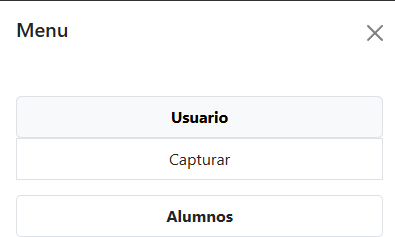
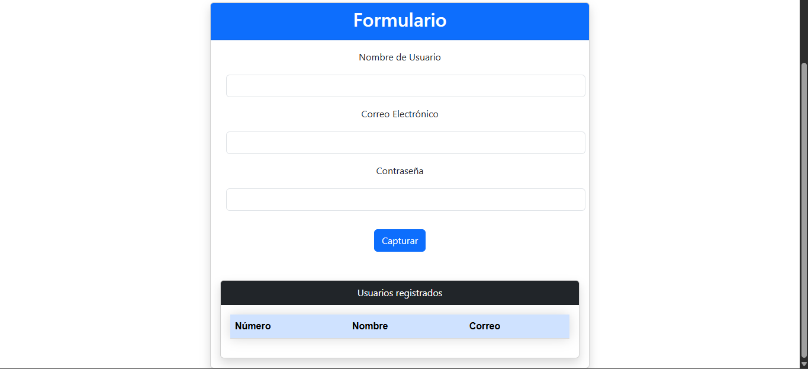
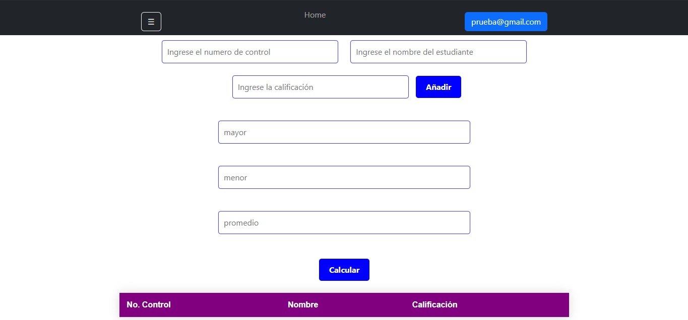

# Proyecto de Login con Bootstrap

## Portada

**Materia:** Programación Web

**Actividad:** Proyecto de Login

**Docente:** *Martinez Nieto Adelina*

**Integrantes del equipo:**
- Hernández Ruiz Jonatan Gadiel
- Jarquin Rivera Orlando Miguel

**Fecha:** *08/07/2026*

---

# Descripción del proyecto

Este proyecto consiste en desarrollar una aplicación web con un sistema de inicio de sesión (Login) utilizando **HTML, JavaScript y Bootstrap**.

Después de iniciar sesión correctamente, el usuario accede a una página principal donde puede navegar mediante un **Navbar** y un **Sidebar**, desde los cuales puede acceder a los diferentes módulos del sistema, como el registro de usuarios y el módulo de alumnos.

El proyecto implementa validaciones reutilizables, almacenamiento local y una interfaz responsiva utilizando Bootstrap.

---

# Framework CSS utilizado

Se utilizó **Bootstrap 5.3**, incorporado mediante CDN.

Bootstrap permitió utilizar componentes como:

- Navbar
- Offcanvas (Sidebar)
- Cards
- Formularios
- Botones
- Tablas
- Toast (Notificaciones)
- Collapse

CDN utilizada:

```html
<link href="https://cdn.jsdelivr.net/npm/bootstrap@5.3.0/dist/css/bootstrap.min.css" rel="stylesheet">
```

---

# Flujo del Login

El funcionamiento del sistema es el siguiente:

1. El usuario abre `login.html`.
2. Ingresa su correo electrónico y contraseña.
3. JavaScript valida ambos campos mediante funciones del archivo `utileria.js`.
4. Si las validaciones son correctas:
   - Se guarda el usuario mediante **LocalStorage**.
   - Se redirecciona automáticamente a `index.html`.
5. En `index.html` se recupera el usuario almacenado y se muestra en el Navbar.

### Diagrama del flujo

```
Login
   │
   ▼
Validaciones
   │
   ▼
LocalStorage
   │
   ▼
Index
   │
   ▼
Navbar
```

---

# Paso del usuario del Login al Navbar

Para conservar el usuario entre páginas se utilizó **LocalStorage**.

En `login.js`:

```javascript
localStorage.setItem("usuario", correo);
window.location.href = "index.html";
```

En `index.js`:

```javascript
const usuario = localStorage.getItem("usuario");
document.getElementById("usuario").textContent = usuario;
```

De esta forma el usuario permanece disponible mientras no cierre sesión.

---

# Métodos principales

## validarCorreo()

Valida que el correo tenga un formato correcto mediante una expresión regular.

---

## validarPassword()

Valida que la contraseña tenga:

- Mínimo 8 caracteres.
- Una letra mayúscula.
- Una letra minúscula.
- Un número.
- Un carácter especial.

---

## validarTelefono()

Valida que el teléfono tenga:

- 10 digitos.

---

## calcularEdad()

Calcula la edad a través de que el usuario le ingrese su fecha de nacimiento.

---

## mayorDeEdad()

Valida que sea mayor de edad mediante clacularEdad(fechaNacimiento) >= 18;

---

## validarNumeroControl()

Valida que el número de control tenga 8 digitos entre el 0-9. 

---

## soloLetras()

Permite únicamente letras y espacios.

---

## iniciarSesion()

Obtiene los datos del Login, ejecuta las validaciones y redirecciona al usuario cuando toda la información es correcta.

---

## validarFormulario()

Valida:

- Nombre
- Correo
- Contraseña

Después:

- Agrega el usuario a la tabla.
- Limpia el formulario.
- Muestra un Toast de éxito.

---

## Anadir()

Agrega un alumno al arreglo.

---

## Calcular()

Calcula:

- Mayor calificación.
- Menor calificación.
- Promedio.

---

## actualizarTabla()

Actualiza dinámicamente la tabla de alumnos.

---

# Proceso de creación

## Paso 1. Creación del Login

Se diseñó un formulario utilizando Bootstrap con:

- Correo electrónico
- Contraseña

Posteriormente se agregaron las validaciones utilizando funciones del archivo `utileria.js`.

### Captura




---

## Paso 2. Validaciones

Se reciclo utileria.js para las validaciones de este proyecto.

---

## Paso 3. Navbar

Se implementó un Navbar con Bootstrap.

Incluye:

- Botón para abrir el Sidebar.
- Nombre del usuario.
- Opción para cerrar sesión.

### Captura




---

## Paso 4. Sidebar

Se implementó un menú lateral utilizando el componente **Offcanvas**.

El menú permite acceder a:

- Capturar Usuario.
- Alumnos.
- Calcular Edad.

### Captura



---

## Paso 5. Formulario de Usuarios

Se creó un formulario con Bootstrap para registrar usuarios.

Campos:

- Nombre.
- Correo.
- Contraseña.

Cuando la información es correcta:

- Se muestra un Toast.
- Se agrega el usuario a la tabla.
- Se limpia el formulario.

Cada usuario registrado se agrega automáticamente a una tabla con:

- Número.
- Nombre.
- Correo.

### Captura



---


## Paso 6. Módulo de Alumnos

Se integró un módulo para registrar alumnos.

Permite:

- Agregar estudiantes.
- Mostrar la información en una tabla.
- Calcular mayor calificación.
- Calcular menor calificación.
- Calcular promedio.

### Captura



---


---

# Tecnologías utilizadas

- HTML5
- CSS3
- Bootstrap 5.3
- JavaScript (ES6 Modules)
- LocalStorage
- SweetAlert2
- Bootstrap Toast

---

# Conclusión

Durante el desarrollo del proyecto se aplicaron los conocimientos adquiridos en la materia de Programación Web mediante la creación de una aplicación funcional con un sistema de autenticación, navegación mediante componentes de Bootstrap y validación de formularios utilizando JavaScript.

Además, se implementó la reutilización de funciones mediante módulos, el almacenamiento de información utilizando LocalStorage y una interfaz responsiva que mejora la experiencia del usuario.